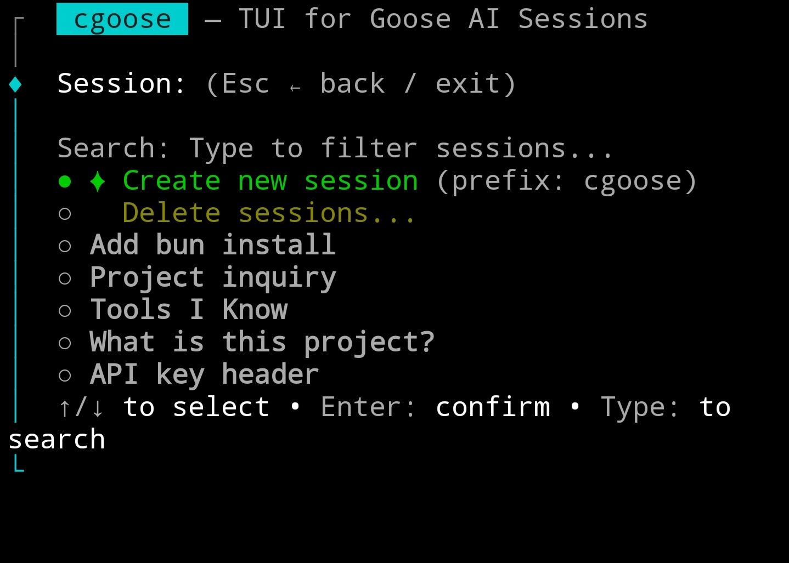
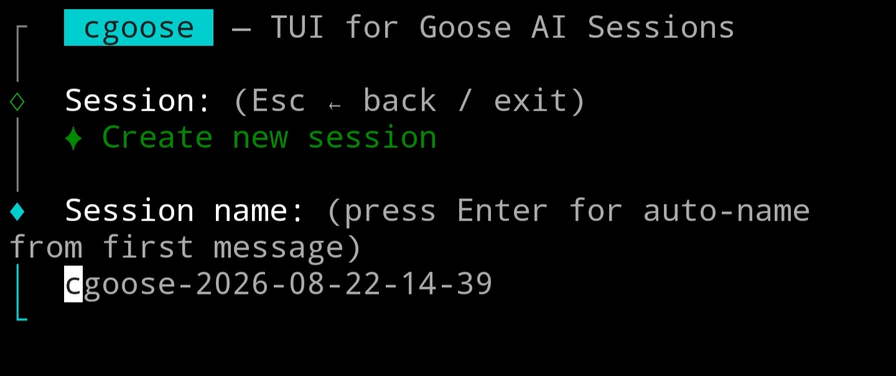
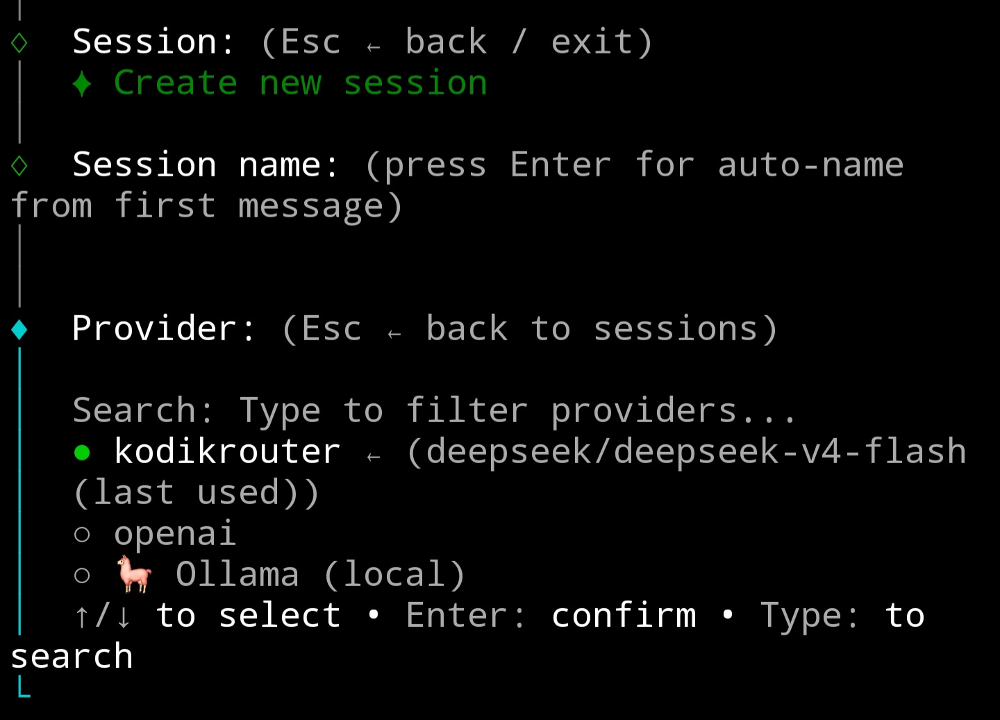
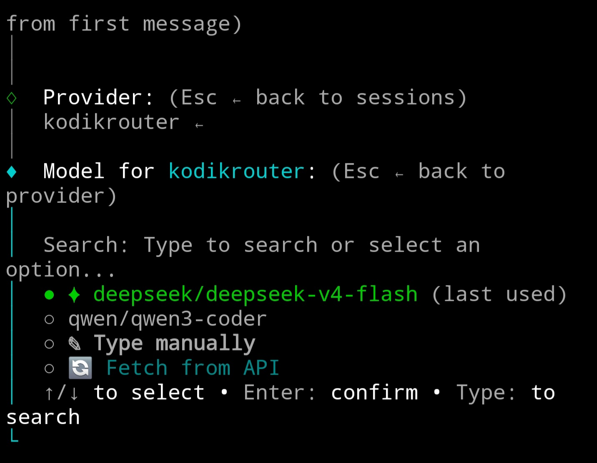

# cgoose — Agentic AI Session Manager

**cgoose** is a TUI (Terminal User Interface) for managing [Goose](https://github.com/block/goose) AI sessions. It provides an interactive multi-step workflow for selecting or creating sessions, choosing providers and models, and launching Goose.

Built with [Clack](https://github.com/natemoo-re/clack) prompts + [picocolors](https://github.com/alexeyraspopov/picocolors).

## Screenshots









---

## Architecture

### Language & Runtime
- **TypeScript** — runs under [Bun](https://bun.sh)
- Entry point: `src/index.ts` (~520 lines)
- Modular design — 7 source files under `src/`

### Dependencies
| Package | Purpose |
|---------|---------|
| `@clack/prompts` | Interactive TUI prompts |
| `picocolors` | Terminal styling |
| *(stdlib)* | `child_process`, `fs`, `path`, `os`, `crypto`, `process` |

### Config / Data Paths
| Path | Purpose |
|------|---------|
| `~/.config/goose/config.yaml` | Goose config — parsed for enabled providers + top-level env vars |
| `~/.config/goose/custom_providers/*.json` | Custom provider definitions (engine, base URL, auth) |
| `~/.config/cgoose/projects/<dirname>-<hash>.json` | Per-project last-used provider/model (incl. history) |
| `~/.local/share/goose/sessions/sessions.db` | SQLite DB — direct deletion via `sqlite3` |

### Data Flow
```
  Step 1: Session Selection (pick existing / create new / delete)
  Step 2: Session Name (auto: project-YYYY-MM-DD-HH-mm or custom)
  Step 3: Provider Selection (from config.yaml, sorted by history + Ollama)
  Step 4: Model Selection (last used / history / manual / API fetch / Ollama list)
  Step 5: Summary & Launch (goose session --name --provider --model)
```

### Navigation
- **Esc** at any step goes back one step (not abort)
- All prompts are cancellable — natural exploration flow
- Session list supports fuzzy filtering

---

## Source Modules (`src/`)

### `index.ts` — Main TUI loop
Entry point. Orchestrates the 5-step workflow as a `while (true)` state machine with `Step` union type (`"session" | "session_name" | "provider" | "model" | "launch"`). Manages navigation, displays prompts, and coordinates all modules.

### `config.ts` — Provider configuration
- **`parseYamlProviders()`** — Minimal YAML parser (no external lib). Extracts enabled providers + default models from `~/.config/goose/config.yaml`.
- **`enrichProviders()`** — Reads `custom_providers/*.json` files for engine, baseUrl, authToken (supports env var references, Authorization headers, secrets).
- **`getConfigProviders()`** — Combines both above.
- **`loadConfigEnvVars()`** — Injects top-level YAML keys into `process.env` so child processes inherit them (e.g., `OPENAI_API_KEY`).

### `launcher.ts` — Goose process launcher
- **`launchGoose()`** — Spawns `goose session` with correct args (`--resume --history` for existing, `--name`, `--provider`, `--model`). Handles custom providers by setting `OPENAI_BASE_URL` + `OPENAI_API_KEY` env vars (clears conflicting vars first). Saves project meta before launching. Stdio: inherit.

### `models.ts` — Model discovery
- **`detectOllama()`** — Hits `http://localhost:11434/api/tags` (2s timeout). Returns models with `supportsTools` flag based on capabilities.
- **`fetchModelsFromApi()`** — For OpenAI-compatible APIs: hits `GET /v1/models` with auth header (15s timeout). Returns sorted model IDs with spinner feedback.

### `project.ts` — Per-project memory
- **`getProjectKey()`** — Deterministic key: `<dirname>-<sha256(dir)[:8]>` from CWD.
- **`readProjectMeta()`** — Reads `~/.config/cgoose/projects/<key>.json`. Handles migration from old format (`{ provider, model }` → `{ provider, modelHistory, providerHistory }`).
- **`writeProjectMeta()`** — Updates provider + model history (last 10 per provider), provider usage history (last 10), merges with existing data.

### `sessions.ts` — Session CRUD
- **`getAllSessions()`** — Shells out to `goose session list --format json` (10s timeout). Parses JSON from CLI output.
- **`deleteSessionById()`** — Deletes from SQLite directly (3 tables: `messages`, `usage_ledger`, `sessions` in a transaction).
- **`formatSessionHint()`** — Formats session for display: name, provider, model (truncated), date (ru-RU locale), message count.

### `utils.ts` — Utility functions
- **`getCurrentDirName()`** — Returns basename of CWD.
- **`generateSessionName()`** — Auto-name: `<dirname>-YYYY-MM-DD-HH-mm`.

---

## Key Features

### Session Management
- List sessions for current directory (filtered by `working_dir`)
- Fuzzy search across sessions
- Create new with auto-name or custom name (validates uniqueness, no spaces)
- Resume existing session
- **Delete UI**: select individually (multiselect) or "clean all" for directory

### Provider Selection
- Sorted by usage history (most recent first), then alphabetical
- Highlights: `← last used`, `(history)`, `(session provider)`
- **Ollama integration**: auto-detects running Ollama instance, shows model count + tool support status
- Supports any number of enabled providers from config.yaml

### Model Selection
- Shows last used model as default (`✦`)
- Model history per provider (previously used models)
- Manual input fallback
- **API fetch**: hits `GET /v1/models` on OpenAI-compatible endpoints
- **Ollama models**: lists with tool support badges, warns if selected model lacks tool calling
- Validation: non-empty model name required for manual input

### Launch
- Sets `OPENAI_BASE_URL` + `OPENAI_API_KEY` for custom providers
- Clears conflicting env vars (`OPENAI_HOST`, `OPENAI_BASE_PATH`)
- Resumes existing sessions with `--resume --history`
- Spawns goose with `stdio: inherit`; forwards exit code

---

## Key Design Decisions

1. **Modular architecture** — 7 focused modules under `src/`. Each module has a single responsibility. Total ~900 LOC.
2. **Minimal dependencies** — Only `@clack/prompts` and `picocolors`. No YAML parser, no ORM (raw `sqlite3`), no HTTP client (native `fetch`).
3. **Per-project memory** — Persists last-used provider+model per directory, not globally. Tracks full history (last 10 providers, last 10 models per provider). Supports migration from legacy format.
4. **Navigation loop** — `Esc` goes back one step instead of aborting. Natural exploration flow.
5. **Direct SQLite deletion** — Bypasses Goose CLI, writes SQL directly for speed and reliability.
6. **Ollama-first** — Auto-detects local Ollama, warns about tools support, integrates as a first-class provider.
7. **Custom provider support** — Reads engine/baseUrl/auth from JSON files, injects env vars at spawn time, clears conflicting vars.