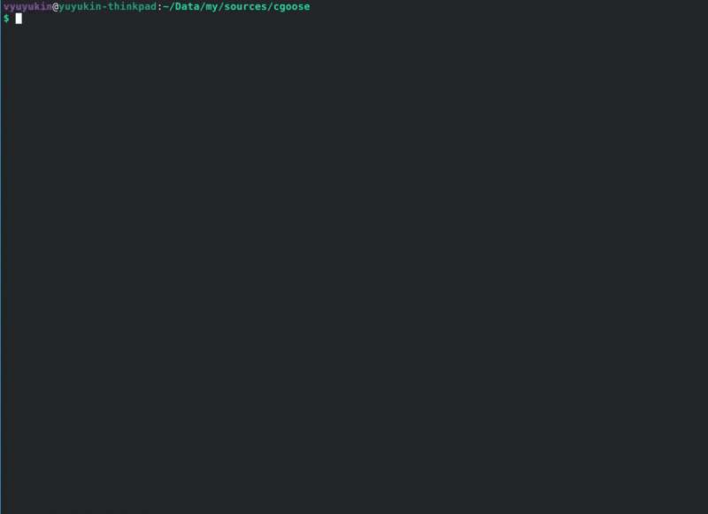

# cgoose — TUI for Goose AI Sessions

**cgoose** is a terminal UI for [Goose](https://github.com/block/goose) — your AI coding agent. It replaces raw CLI commands with an interactive multi-step workflow to pick sessions, providers, and models.

> Built with [Clack](https://github.com/natemoo-re/clack) prompts + [picocolors](https://github.com/alexeyraspopov/picocolors), runs on [Bun](https://bun.sh).
>
> **⚠ Tested only on Linux.** May work on macOS (secret-tool not available, but file-based secrets should work). Windows is not supported.

---

## Demo



---

## Screenshots

| Session list | New session |
|:--:|:--:|
|  |  |
| Provider selection | Model selection |
|  |  |

---

## Why cgoose?

Goose's CLI works, but every time you start a session you need to remember:

- What provider did I use last time in this project?
- What model?
- What session name?

**cgoose remembers.** It keeps per-project history of providers and models, shows you what you used last, and lets you fetch models directly from the API instead of typing them by hand.

---

## Installation

### Option 1: Standalone binary (no runtime needed)

```bash
bash build.sh
./cgoose
```

Requires **Bun** to build, but the resulting binary runs on any Linux x86_64 without Bun.

### Option 2: Local install (requires Bun)

```bash
bash install.sh
cgoose
```

Installs source + deps to `~/.local/lib/cgoose/` and a launcher to `~/.local/bin/cgoose`. Make sure `~/.local/bin` is in your `PATH`.

### Option 3: Run from source (requires Bun)

```bash
bun install
bun start
```

---

## Features

### Session Management
- **List sessions** for current working directory with fuzzy search
- **Create new** — custom name or leave empty for auto-name from first message
- **Resume** existing sessions with full history
- **Batch delete** — pick individually or clean all sessions for the current directory

### Provider Selection
- Sorted by your usage history (most recent first), then alphabetically
- Shows last used, history, and session provider hints
- **Ollama** — auto-detected if running locally, shows model count + tool support
- Supports any number of enabled providers from your Goose config
- Custom providers (`custom_*`) only shown when a JSON config file exists

### Model Selection
- **Last used model** shown as default (`✦`)
- **Model history** per provider — previously used models at your fingertips
- **Fetch from API** — hits `GET /v1/models` on OpenAI-compatible endpoints, parses `context_limit`/`max_context`/`context_window` if available
- **Ollama models** — lists with tool support badges, warns if model lacks tool calling
- **Manual input** fallback with validation

### Context Limit
- When discovery or manual input finds a model not yet in the provider's JSON config, cgoose prompts you for a **context limit** (in tokens)
- If the API returned context info (KodikRouter, llama.cpp, etc.), it's pre-filled as the default
- Otherwise defaults to `128000` (Goose's built-in default)
- **On launch**, cgoose sets `GOOSE_CONTEXT_LIMIT` so Goose actually uses the value instead of falling back to its canonical registry or `DEFAULT_CONTEXT_LIMIT`

### Secrets & Auth
- Reads API keys from all Goose storage backends:
  - **System keyring** (libsecret — works with GNOME Keyring, KDE Wallet, KeePassXC, etc.)
  - **File-based** (`~/.config/goose/secrets.yaml`)
  - Environment variables
- If a key is missing, cgoose shows a clear hint about which variable to set

### Launch
- Sets `OPENAI_BASE_URL` + `OPENAI_API_KEY` for custom providers
- Clears conflicting env vars (`OPENAI_HOST`, `OPENAI_BASE_PATH`)
- Sets `GOOSE_CONTEXT_LIMIT` from the provider's JSON model config
- Resumes existing sessions with `--resume --history`
- Spawns `goose session` with `stdio: inherit`, forwards exit code

---

## Workflow

1. **Choose a session** — pick from existing sessions for this directory, create new, or delete
2. **Name the session** — enter a custom name or leave empty for auto-name from first message
3. **Pick a provider** — sorted by your history, shows Ollama if running locally
4. **Pick a model** — last used, history, fetch from API, or type manually
5. **Context limit** (if new model for custom provider) — enter tokens or accept default
6. **Launch** — summary screen → `goose session` starts in the same terminal

Pressing **Esc** at any step goes back one step (not abort).

---

## Data Locations

| What | Where |
|------|-------|
| Provider config | `~/.config/goose/config.yaml` |
| Custom provider defs | `~/.config/goose/custom_providers/*.json` |
| Secrets (keyring) | System keyring via libsecret (service: `secrets@goose:default`) |
| Secrets (file) | `~/.config/goose/secrets.yaml` |
| Per-project history | `~/.config/cgoose/projects/<dir>-<hash>.json` |
| Session DB | `~/.local/share/goose/sessions/sessions.db` |

---

## CLI Flags

Run cgoose with a single-letter mode (like tmux):

| Mode | What it does |
|------|-------------|
| `a` | **Auto-resume** — jump straight to launch with the last session, provider, and model for this project |
| `n` | **New session** — skip pickers, start a new session with the last provider and model |
| `s` | **Sessions only** — show only the session picker, skip provider and model selection, use last used |

If there's no project history for the current directory, the flag is ignored and the full workflow runs.

```bash
cgoose a    # resume last session
cgoose n    # new session with last provider/model
cgoose s    # pick a session, then launch
```

## Scripts

| Script | What it does |
|--------|-------------|
| `build.sh` | Compiles a standalone binary (`./cgoose`) with Bun runtime embedded |
| `install.sh` | Installs source to `~/.local/lib/cgoose/` + launcher to `~/.local/bin/cgoose` |

---

## License

MIT