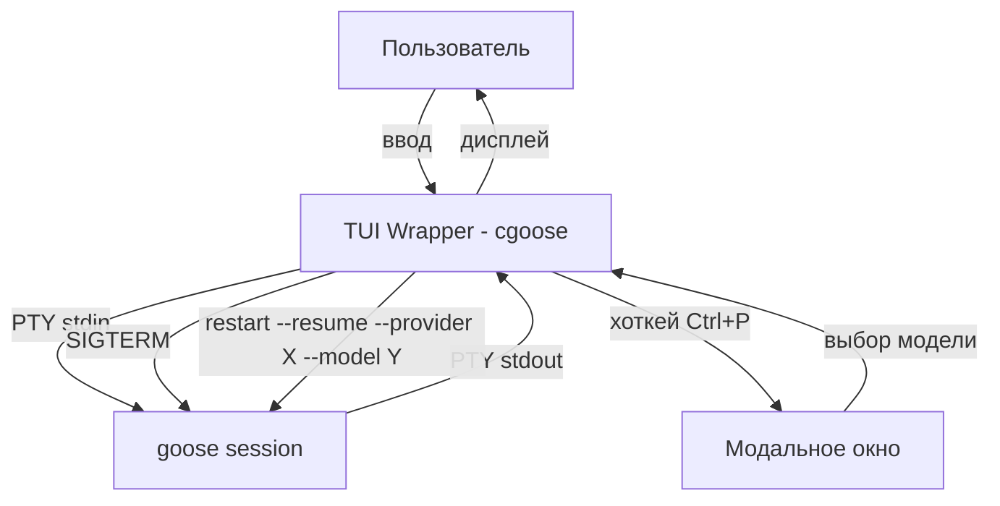

# TUI Wrapper for Goose CLI

## Исследование исходного кода goose

Дата: 2026-08-22
Ветка: `feature/tui-wrapper`
Исходники goose: `../goose`

---

## 1. Архитектура goose CLI

### Goose CLI (`crates/goose-cli/src/cli.rs`)
- **Rust** проект с `clap` для парсинга аргументов
- Команда `session` → `handle_interactive_session()` → `build_session()` → `session.interactive()`

### REPL-цикл (`crates/goose-cli/src/session/mod.rs`)
- Использует `rustyline` для ввода (не raw stdin! — **требует TTY**)
- Главный цикл: `run_interactive()`:
  ```
  loop {
      display_context_usage()
      input = input::get_input(&mut editor)  // ← rustyline
      handle_input(input)
  }
  ```
- Ввод через `read_paste_aware_input()` который использует `rustyline::Editor`

### `goose term run` (headless mode)
- Использует `headless(prompt)` — не требует TTY, но это **не интерактивный режим**
- Одноразовый: берёт промпт, выполняет, завершается

### `goose tui` 
- Это просто `npx @aaif/goose@latest goose-tui` — отдельный Node.js TUI, запускается через `exec()`

---

## 2. Ключевые флаги `goose session`

| Флаг | Описание |
|------|----------|
| `-r, --resume` | Продолжить последнюю сессию (или по `--name`/`--session-id`) |
| `--fork` | Копирует все сообщения из сессии в новую. Требует `--resume` |
| `--edit` | Открывает $EDITOR для редактирования сообщений перед рестартом |
| `--history` | Показать историю сообщений при resume |
| `--provider <NAME>` | Переопределить провайдера |
| `--model <MODEL>` | Переопределить модель |
| `-n, --name <NAME>` | Имя сессии (для resume — найти по имени) |
| `--session-id <ID>` | ID сессии (требует --resume) |

### Комбинации:
- `goose session --resume --provider X --model Y` — **смена модели при resume** (работает!)
- `goose session --resume --fork` — создаёт копию сессии
- `goose session --resume --fork --edit` — копирует и открывает в $EDITOR

---

## 3. Смена модели на лету (изнутри сессии)

В REPL есть встроенная slash-команда **`/model`**:

```rust
async fn handle_model(&mut self, options: input::ModelCommandOptions) -> Result<()> {
    // Меняет провайдера/модель через self.agent.update_provider()
    // БЕЗ перезапуска сессии!
}
```

- `/model` — показать текущую модель
- `/model gpt-4o` — сменить модель (тот же провайдер)
- `/model --provider openai` — сменить провайдер (дефолтная модель)
- `/model --provider openai gpt-4o` — сменить и провайдер, и модель

**Ограничения:**
- Не работает для APC-провайдеров (заканчиваются на `-acp`)
- Не работает для провайдеров, управляющих своим контекстом (Claude Code и др.)

---

## 4. Форк сессии (из CLI, не из REPL)

```rust
// В handle_interactive_session():
if fork {
    let copied = session_manager.copy_session(id, original.name.clone()).await?;
    session_id = Some(copied.id);
    // Если edit — открывает $EDITOR для редактирования
}
```

- `session_manager.copy_session()` из `crates/goose/src/session/session_manager.rs:520`
- Копирует все сообщения в новую сессию
- Возвращает новый `Session` с новым ID

---

## 5. Сигналы (`crates/goose-cli/src/signal.rs`)

```rust
pub fn shutdown_signal() -> Pin<Box<dyn Future<Output = ()> + Send>> {
    // Перехватывает SIGINT (Ctrl+C) и SIGTERM
    // Использует tokio::signal
}
```

Goose корректно обрабатывает Ctrl+C — двойное нажатие завершает сессию (через `HintStatus::MaybeExit` в `input.rs`).

---

## 6. Критическое открытие: TTY Required

**Экспериментально подтверждено:**
```
$ echo "test" | timeout 5 goose session --resume --provider openai --model gpt-4o
error: Failed to get user input: not connected
```

Goose interactive mode **требует TTY**. Это означает:
- Простой `spawn` с pipe stdin/stdout **не сработает**
- Нужен **PTY (псевдотерминал)** для запуска goose в обёртке

---

## 7. База данных сессий

SQLite `~/.local/share/goose/sessions/sessions.db`:
- `sessions` — сессии (id, name, working_dir, ...)
- `messages` — сообщения
- `usage_ledger` — использование токенов
- `provider_inventory_entries`, `provider_inventory_models` — кэш провайдеров

---

## 8. Выводы для архитектуры обёртки

### Вариант B (PTY) — единственный рабочий



### Ключевые решения:
1. **Использовать `node-pty`** (или `@bun/pty` если Bun поддерживает) для создания PTY
2. **Перехват ввода**: перед отправкой в PTY проверять, не хоткей ли это
3. **Overlay-рендеринг**: временно приостанавливать поток PTY-вывода для показа диалогов
4. **Смена модели**: 
   - Быстрый путь: отправить `/model gpt-4o\n` прямо в PTY (используя встроенную команду goose)
   - Альтернатива: убить goose и перезапустить с `--resume --provider X --model Y`
5. **Форк**: убить goose → `goose session --resume --fork --provider X --model Y` → запуск

### Практические команды для реализации:

```bash
# Смена модели через resume (перезапуск)
goose session --resume --session-id <ID> --provider <PROVIDER> --model <MODEL>

# Форк сессии
goose session --resume --fork --provider <PROVIDER> --model <MODEL>

# Получение списка сессий
goose session list --format json
```

---

## 9. Реализация — `wrapper.ts` (v1)

### Файл: `wrapper.ts` (448 строк, TypeScript/Bun)

### Что реализовано:

- **PTY-запуск goose** — через `Bun.spawn(["goose", ...args], { pty: true })`
- **stdin = FileSink** — в PTY-режиме stdin это `FileSink` с синхронным `.write()`
- **pipe stdout/stderr** — асинхронное чтение через `getReader()` и запись в реальный терминал
- **Raw mode** — `Bun.Terminal.setRawMode(true)` для перехвата клавиш
- **Resize forwarding** — `process.stdout.on("resize")` → `terminal.resize(rows, cols)`

### Горячие клавиши:
| Клавиша | Действие |
|---------|----------|
| **Ctrl+P** (0x10) | Открывает диалог выбора провайдера/модели → отправляет `/model --provider X Y` в PTY |
| **Ctrl+F** (0x06) | Подтверждение → SIGTERM → `goose --resume --fork --provider X --model Y` |
| **Ctrl+Q** (0x11) | Подтверждение → SIGTERM → exit |
| **Ctrl+C** (0x03) | Пробрасывается в goose (он сам обрабатывает двойной Ctrl+C) |

### Ключевые технические решения:
- **Bun.Terminal** для raw mode (native Bun API, не нужен node-pty)
- **Bun.spawn с `pty: true`** — создаёт PTY для goose
- **FileSink.write()** — синхронная запись в PTY stdin (не WritableStream)
- **@clack/prompts** — модальные диалоги (select, text, confirm) при активации хоткея
- **Project meta** — сохраняется в `~/.config/cgoose/projects/<dir>-<hash>.json`

### Известные ограничения v1:
- Нет пре-шага с выбором сессии (сейчас всегда создаёт новую)
- Диалоги Clack прерывают вывод goose (сырой терминал переключается в cooked mode)
- Нет визуального хоткей-хинта (пользователь должен знать Ctrl+P/F/Q)
- `/model` команда не показывает результат (отправлена, но фидбек только в stdout goose)

## 10. Todo

1. [x] Исследовать поведение goose при pipe stdin/stdout — **TTY required!**
2. [x] Проверить флаги `--resume`, `--fork`, `--edit`
3. [x] Проверить встроенную команду `/model`
4. [x] Выбрать PTY-библиотеку — **Bun.spawn с `pty: true`** (native)
5. [x] Реализовать базовую обёртку: PTY spawn → перехват клавиш → overlay
6. [x] Диалог смены модели на лету
7. [x] Диалог форка сессии
8. [ ] Session picker как в index.ts (выбор существующей / создание новой)
9. [ ] Status bar с горячими клавишами
10. [ ] Сплит-экран: goose output + вспомогательная панель
11. [ ] Graceful handling: показать результат `/model` команды
12. [ ] Интеграция с `index.ts` (cgoose → wrapper, единый entry point)